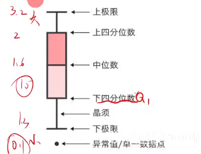

# 查数据
## 查数据平台

**优先在知网谷歌学术等平台搜索**，然后才在下面的网站里面寻找
### 国家统计局
最全面，月度季度年度，各地区各部门各行业，包罗万象。 [https://data.stats.gov.cn/](https://data.stats.gov.cn/) 其他国家部门网站大多都有数据分页，如果需要可另行查找
### awesome-public-datasets
GitHub上的一个项目，包含了经济、地理、能源、教育等所有你能想到的领域的数据.[https://github.com/awesomedata/awesome-public-datasets](https://github.com/awesomedata/awesome-public-datasets) (如果网页打不开，可尝试用登外网的方法)
### EPSDATA平台
EPSDATA平台有丰富的数据资源和大量分析处理过的数据结果，是收费的，不过可以申请7天的试用。 。 [https://www.epsnet.com.cn/](https://www.epsnet.com.cn/) 

其他:国家信息中心，kaggle，和鲸社区

# 数据预处理
## 缺失值补全的方法
- 比赛提供的数据可能会有null
- 有些缺失的非常多了，就应该删除（比如40%）
- 均值或者众数查补方法：
	- 定量数据：身高、年龄等可以使用均值
	- 定性数据：比如性别，文化程度，满意度等就可以用众数
	- 适用赛题：人口数量年龄经济产业情况等等，**对个体精度不大的数据**
- newton插值法（数值精确，不关心变化）
	- 根据固定公式构造近似函数补上缺失值
	- 缺点：边缘不稳定（龙格现象），不适合对导数有要求的题目
	- 使用赛题：热力学温度，地形测量定位等等只追求数值精准但是不关心变化的数据
- 样条差值法（关心变化并且要求可导）
	- 分段光滑的曲线差值，光滑意味着曲线连续并且有曲率可导
	- 适用赛题：零件加工，水库水流量，图像的基线漂移，机器人轨迹等等进度要求高并且没有突变的数据
- 分段差值……但是上面基本都够用了
## 异常值
- 样本中和其他数据差值很大的傻逼值
## 如何找到异常值
### 正态分布的3Σ原则
- 数值分布在$$
(\mu - 3\sigma,\ \mu + 3\sigma)
$$
中的概率为99.73%
- 步骤：
	1. 计算均值u和标准差Σ
	2. 判断每个数据是否在$(\mu - 3\sigma,\ \mu + 3\sigma)$分布内
	3. 如果不在就是异常值
- 适用：总体符合正态分布，人口数据，测量误差，生产加工质量，考试成绩……
- 不适用：总体符合其他的分布，比如公交站人数排队符合泊松分布等等
### 画箱型图
- 将数据从小到大排序，下四分位数Q1是排第25%的数值，上四分位数是排75%的数值
- 
- **四分位距**（IQR)：上四分位数（Q3）- 下四分位数（Q1）箱型区间
- 一般设置$$[Q_1 - 1.5 \times IQR,\ Q_3 + 1.5 \times IQR]$$内为正常值
- 适用：普遍适用

==找到异常值之后处理方法与处理缺失值相同==
