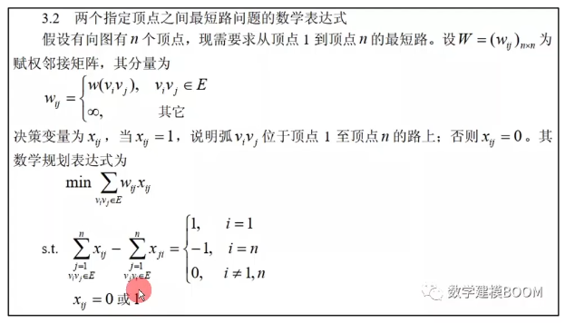

# 过程
- 先看文献，一切先有迹可循
- 看不懂原理没关系，先做出来再说
- 不论对错，管用即可
1. 一篇完整的数模论文：
	1. 摘要
	2. 问题重述
	3. 模型假设
	4. 符号说明
	5. 模型建立与求解（最长）
	6. 模型的优缺点与改进方法
	7. 参考文献
	8. 附录
## 摘要
1. 研究的问题
2. 用了什么方法
3. 有什么结果
4. 每一个部分的大致步骤
## 问题重述
1. 题目简述一遍就可以，但是不能直接copy
2. 不要复制粘贴会查重
## 模型假设和符号说明
1. 好的假设能让你事半功倍
2. 符号表格说明即可
3. 例如某一年太阳投影问题，影子长度虽然与地球公转也有关系，但是地球公转对影长影响较小，那么就可以做出假设：“忽略公转对影长的影响”
## 模型的建立
1. 一组公式，和对公式的每个变量的解释，就是一个模型
2. 先查阅模型，然后看着资料用自己的话复述一个简单的模型，然后用题目约束条件一步步修改模型，把变量带进模型
3. e.g.
4. 必须根据赛题解释清楚“起始点”在本问题中究竟是什么，算法节点在本题中实际意义是什么，最短路径是意味着什么等等
## 针对大题中的不同小问
1. 并不是每一问哦度建立一个模型
2. 如果每个小问有相似性而仅仅是增加约束条件的话，就可以直接全文建立一个模型，针对每一个小问进行改进
## 模型优缺点和改进方法（非必须）
1. 可简单分析前文模型的优缺点，如果没有改进方法也可以不写
2. 结合文献分析正文中的模型常用在什么问题，与本文所求解的问题有什么区别
## 参考文献
1. 格式一定要规范！用知网的引用按钮复制
## 附录
1. 附录里要写出正文中求解使用的代码
2. 不要把人家的代码直接黏贴上去
