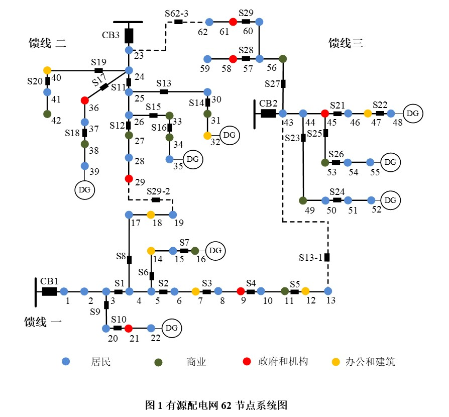

## 背景知识

随着我国双碳目标的推进，可再生分布式能源在配电网中的大规模应用不可避免，这对传统配电网运行提出挑战。为了量化分析配电网中接入分布式能源的风险，需要对其进行建模与分析。

配电网发生故障后失负荷，可以通过联络线实现部分复电，供电恢复的目标是在系统拓扑结构发生变化时，将系统的经济损失降至最小。行业分类将消费者分为居民住宅、商业、政府机构和办公建筑等类别，按照这种分类，供电中断危害可依据部门客户危害度函数进行计算。

分布式能源接入配电网，由于其发电出力的波动性与不确定性，对馈线的失负荷和过负荷带来影响。为了提高配电网就地消纳能力，本竞赛题目要求分布式能源不得向上级电网倒送功率。

风险评估的通用计算公式为：

$$ R_{sys} = PLL \cdot CLL + POL \cdot COL $$

其中：
- \( R_{sys} \)：系统风险
- \( PLL \)：系统失负荷的发生概率
- \( CLL \)：由系统失负荷造成的危害程度
- \( POL \)：系统过负荷的发生概率
- \( COL \)：由系统过负荷造成的危害程度

由公式可知，风险评估的量化计算为该场景下各事件概率与其危害的乘积之和。为了实现风险评估，需要从事件概率计算及事件造成后果的危害度函数构建两方面入手进行分析与建模。

---

## 名词解释

- **失负荷**：因故障导致负荷供电中断。
- **过负荷**：线路电流超过额定载流量10%以上。
- **馈线**：从变电站出线开关到终端负荷的配电线路。
- **联络线**：通过联络开关连接不同馈线的线路，正常运行时联络开关处于断开状态，根据运行方式调整的需要可以调整联络开关的状态，实现馈线间的功率转移。
- **配电网的运行方式**：在同一时刻，馈线上的每个负荷与各变电站之间只有一条通路（只由一个变电站出线开关 CB 供电），每个分布式电源 DG 都可接入馈线供电，不同用户类型的停电损失会造成不同的危害度。

---

## 计算配电系统风险的约束条件

1. 各个类型故障是独立发生的，同一时间同一类型只发生一个故障。
2. 不考虑无功功率和电压越限的影响，风险计算分析仅考虑有功功率和电流的影响。
3. 联络开关不考虑故障恢复的自愈系统对失负荷的影响，但需考虑联络开关的负荷转移能力。

---

## 问题

1. **模型建立**  
    请分别建立分布式能源接入配电网后，配电系统的失负荷风险和过负荷风险的计算模型，要求：
    - 失负荷风险模型需考虑本馈线故障造成的负荷损失可以从其他相邻馈线通过联络线转供实现复电的情况。
    - 过负荷风险模型需考虑本馈线的有功功率不得向上级变电站倒送的情况，但可以在相邻馈线间进行调节。

2. **风险演变分析**  
    应用问题 1 所建立的模型，针对附录中的有源配电网 62 节点系统图，在其它参数不变的前提下，分布式能源容量以 \( 0.3I \) 为步长，从初始容量 \( I \) 增加到 \( 3I \)，试分析该配电系统风险 \( R_{sys} \) 的演变情况。

3. **光伏接入容量分析**  
    假设 8 个分布式能源全部为光伏，请查找典型的光伏发电曲线，分析每一个光伏的最大接入容量对系统风险 \( R_{sys} \) 的影响。

4. **储能配置分析**  
    在问题 3 的基础上，假设每个光伏配置不大于 15% 装机容量的储能电池，请分析每一个光伏的最大接入容量对系统风险 \( R_{sys} \) 的影响。

---

## 附录

有源配电网 62 节点系统用来验证所提出的风险评估方法，包含三条馈线，馈线间通过联络开关相互连接，馈线电压为 10kV，3 条馈线额定负载均为 2.2 MW，对应额定载流量为 220A。负载和线路参数见附录 Excel 中表 1 和表 2，8 个分布式能源 DG 从不同位置接入到配电网中，初始容量均为 300kW，如图 1 所示。

- 虚线为馈线间联络线，接入的母线为上级变电站母线。
- **DG** 是分布式能源。
- **CB1~CB3** 为上级变电站的 10kV 出线开关（假设能提供充分大的电源容量）。
- **S1~S62** 为分段开关。
- **S13-1、S29-2、S62-3** 是联络开关。

### 故障单元故障率

- 每个分布式能源和每个用户的故障率均为 0.5%。
- 每个开关的故障率均为 0.2%。
- 配电线路的故障率 = 线路长度（km） × 0.002/km。
